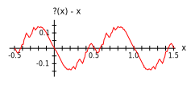
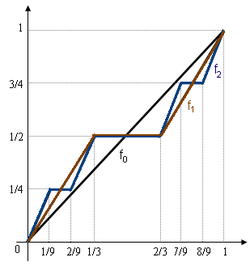

# 7957_Devils_StairCase

```
/* Minkowski's question-mark function */
double minkowski(double x) {
        long p=x; if ((double)p>x) --p; /* p=floor(x) */
        long q=1, r=p+1, s=1, m, n;
        double d=1, y=p;
        if (x<(double)p||(p<0)^(r<=0)) return x; /* out of range ?(x) =~ x */
        for (;;) /* invariants: q*r-p*s==1 && (double)p/q <= x && x < (double)r/s */
        {
                d/=2; if (y+d==y) break; /* reached max possible precision */
                m=p+r; if ((m<0)^(p<0)) break; /* sum overflowed */
                n=q+s; if (n<0) break; /* sum overflowed */
 
                if (x<(double)m/n) r=m, s=n;
                else y+=d, p=m, q=n;
        }
        return y+d; /* final round-off */
}
```

### See files like:



and also, 




---

## More c00L hedges to be unravelled at [`N1X.site`](https://n1x.site)
